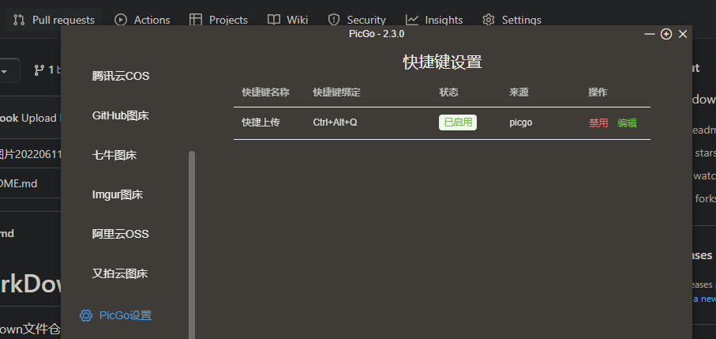

# 这是一级标题

这句话*这是斜体*

**这是粗体**
注意:换行结尾加两个空格,换段落需要回车;

ctrl+b 可以粗体,ctrl+i 斜体

<!-- 可以有代码行数,mpe功能 -->

```javascript {.line-numbers}
console.log('aaa')
const b=2;
```

`const a=1;`

~~sssf~~  alt+s

修改一下

- [x] todo   -空格[空格或x]空格+内容
- [x] iuiu

- item
  - item   tab下一级

1. 有序列表
2. 三扽

- [这是一级标题](#这是一级标题)
  - [一级标题](#一级标题)

---

| 你好 | 你好 | 你好 |
| ---: | :--: | :--- |
|  1.4 | 你好 | 三扽 |

> 这是引用
> 这也是

这是markdown[视频](https://www.bilibili.com/video/BV1si4y1472o/?spm_id_from=333.788.recommend_more_video.0&vd_source=d1f9eb1be9a0de0a0690fb07a1d58ca4)
复制链接后,可以选中文字,然后ctrl+v

---




- [这是一级标题](#这是一级标题)  目录链接,点击可跳转到标题

<!-- todoc是什么 -->
<!-- @import "[TOC]" {cmd="toc" depthFrom=1 depthTo=6 orderedList=false} -->

<!-- code_chunk_output -->

- [这是一级标题](#这是一级标题)
  - [一级标题](#一级标题)

<!-- /code_chunk_output -->

 <!-- slide -->

## 一级标题

 <!-- slide -->
这是**粗体**

==高亮==
